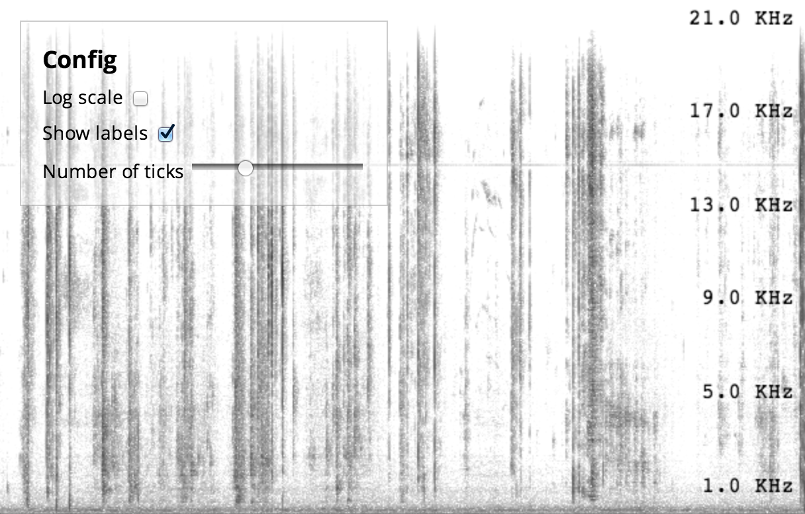
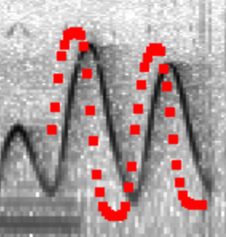

A live-input spectrogram written using [Polymer][polymer] using the [Web
Audio API][wapi].

[See it in action][demo]. Once running, see if you can make a pattern
with your speech or by whistling. You can also click anywhere on the
page to turn on the oscillator. For a bit more fun, [load this][aphex]
in a parallel tab.

[aphex]: https://www.youtube.com/watch?v=M9xMuPWAZW8&t=5m30s
[polymer]: http://polymer-project.org
[wapi]: http://webaudioapi.com
[demo]: http://borismus.github.io/spectrogram

<!--more-->

# Why?

Having a spectrogram is incredibly handy for a lot of the work I've done
recently. So a while ago, I built one that satisfies my needs. It runs
in a full-screen, using the microphone input as the source.

It also includes an oscillator, which plays a sine wave at the frequency
of your pointer. It also shows you the frequency that it plays back, and
plots a short buffer of pointer positions. This is handy for measuring
internal latency:

Having the oscillator built-in is also pretty fun. You can [send morse
code][morse] (short short short, long long, short short long, short
short short), [scan for radio stations][radio], make 8-bit character
[dying sound effects][sfx], simulate [aliens, ghosts and
theremins][ghosts], and annoy [small, annoying dogs][dogs].

I use the tool mostly in Chrome, but it also works in Firefox.
Unfortunately no other browser currently has both `getUserMedia` and Web
Audio API support.

[morse]: sounds/morse.wav
[radio]: sounds/radio.wav
[sfx]: sounds/sfx.wav
[ghosts]: sounds/ghosts.wav
[dogs]: sounds/dogs.wav

# Configuration parameters

The following are HTML attributes of the `g-spectrogram` component. Many
of them are also configurable via the spectrogram controls component,
which shows up if the `controls` attribute is set to true.

- `controls` (boolean): shows a config UI component.
- `log` (boolean): enables y-log scale (linear by default).
- `speed` (number): how many pixels to move past for every frame.
- `labels` (boolean): enables y-axis labels.
- `ticks` (number): how many y labels to show.
- `color` (boolean): turns on color mode (grayscale by default).
- `oscillator` (boolean): enables an oscillator overlay component. When
  you click anywhere in the spectrogram, a sine wave plays corresponding
  to the frequency you click on.

# Using the Polymer component

Simplest possible version:

    <g-spectrogram/>

Enable controls:

    <g-spectrogram controls>
    </g-spectrogram>

Pass parameters to the component:

    <g-spectrogram log labels ticks="10">
    </g-spectrogram>

# Future work / features

It would be great to add a few things to this tool. If you're interested
in contributing, submit your changes as a pull request [on
github][github]. Some ideas for things that can be done:

- Improved axis labeling.
- Make it work in mobile browsers.
- Loading/saving of traces.
- Loading audio data from a file.
- Zoom support.
- Higher precision FFT results (would require writing a custom FFT
  rather than using the one built into Web Audio API.)

[github]: https://github.com/borismus/spectrogram
